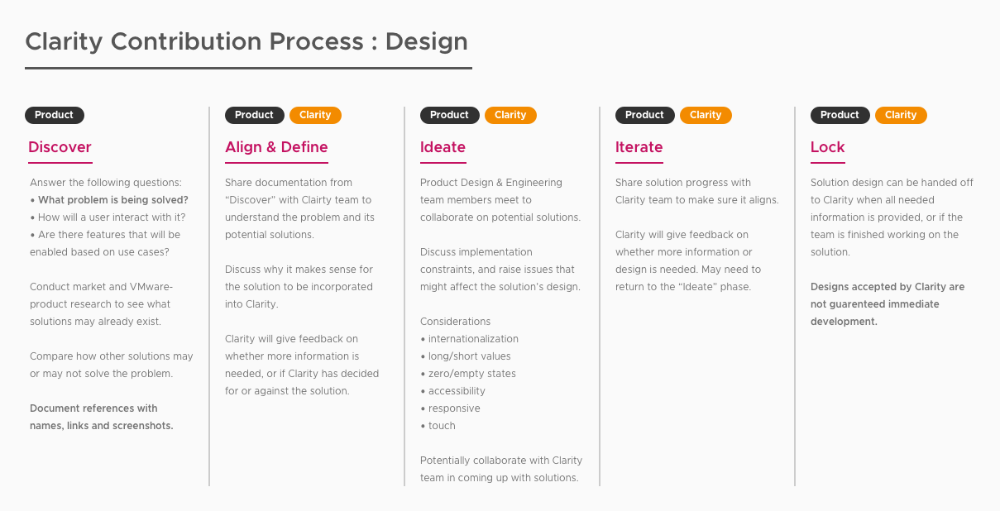

In order to maintain quality of both design and implementation of features, Clarity has the following contribution process that we follow for any major and many minor features or changes. The following applies for both external contributions and those from the team itself.

> The following is a *draft* of the process, and is subject to further refinement.

# Design first

Clarity always defines the UX (user experience) of any feature before any implementation is considered. The details of implementation may be considered during the process (particularly in cases where it may cause a breaking change in behavior or it is technically unfavorable to implement a specific pattern), but in general it is best to avoid the development discussion. The goal is to ensure the user has the best experience, that the feature aligns with Clarity design principles, and meets standards for accessibility and internationalization.

The following graphic shows the basic process, where there is an external request (often from a product or team), and the stages of design.

# Building a design proposal

While we are happy to accept feature requests, we are also happy to accept design proposals that include more detail about how the feature should behave. By providing a design proposal, you'll likely speed up the process. It is worth opening an issue to discuss the basics before starting your proposal.

The format is flexible, but it is best to take a look at some of the [previous UX proposals](https://github.com/vmware/clarity/issues?utf8=%E2%9C%93&q=is%3Aissue+label%3A%22UX+Ready%22) for inspriation. You should provide as much detail, such as the following:

* Description of the request
* Use cases with specific details
* Summary of the research conducted to come up with the specific UX
* Links to some existing examples of similar solutions with details
* Images or animations with mocks showing the design and interactions
* Details of the various permutations
* Accessibility and internationalization considerations
* Animation details when appropriate
* Mobile considerations
* Error states and possible invalid uses
* Possible limitations or drawbacks

To submit your proposal, open an issue with all of your supporting content and then the Clarity design team will get back to you with feedback.